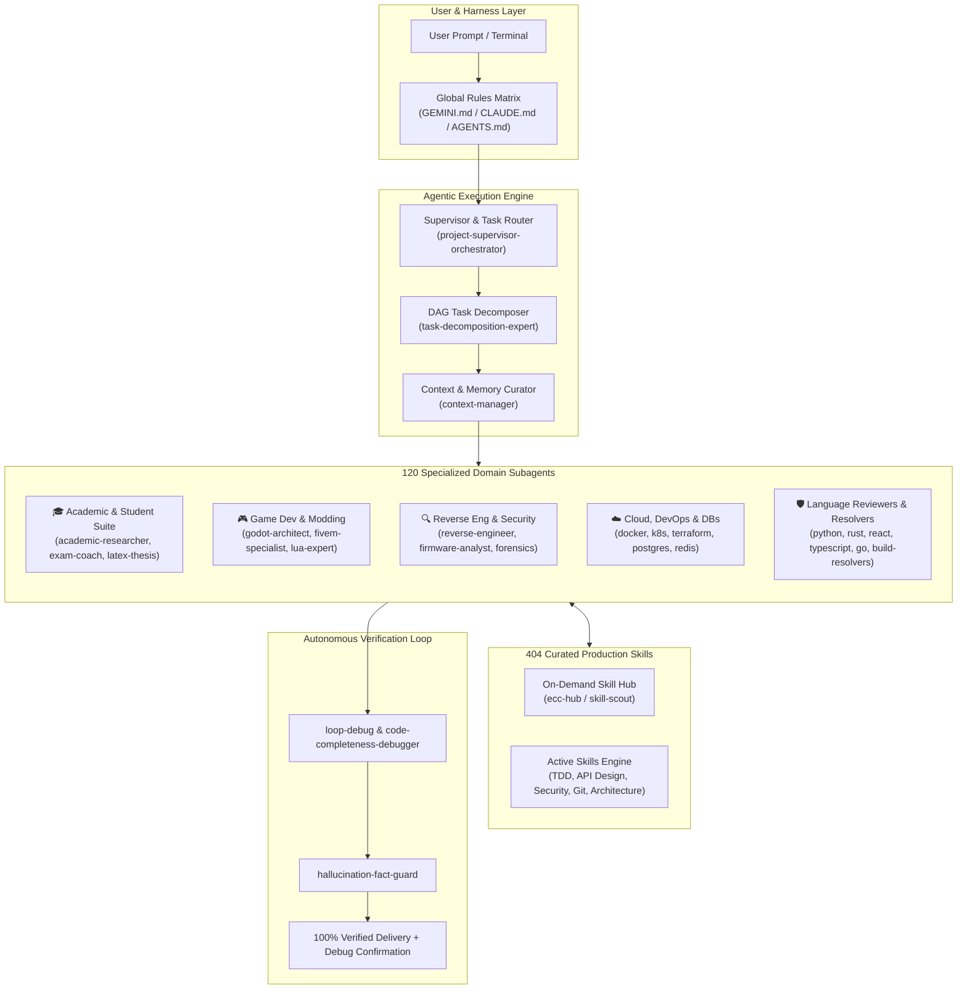

# 🚀 OmniAgentic | المنظومة الشاملة للمهارات والوكلاء البرمجيين

<p align="center">
  
  
  
  
  
</p>

<p align="center">
  <b>Developed & Engineered by <a href="https://github.com/Osama-Alzahrani-UQU">Osama Alzahrani</a></b><br>
  <span>Computer Science • Umm Al-Qura University</span>
</p>

<p align="center">
  <a href="#english-documentation">English Documentation</a> •
  <a href="#arabic-documentation">التوثيق باللغة العربية</a> •
  <a href="#installation--setup">Installation Guide</a> •
  <a href="#agents-showcase">Agents Showcase</a> •
  <a href="#skills-catalog">Skills Catalog</a> •
  <a href="CATALOG.md">Full Catalog</a>
</p>

---

<a name="english-documentation"></a>
## 🌟 Executive Overview (English)

The **OmniAgentic Suite** is a unified, enterprise-grade multi-agent operating framework that equips AI coding assistants (**Antigravity IDE**, **Claude Desktop / Claude Code**, and **OpenAI Codex CLI**) with **404 curated, production-tested engineering skills** and **120 autonomous specialized subagents**.

Engineered specifically to solve the common failure modes of modern agentic workflows (hallucinations, token bloat, forgotten instructions, dropped functions, and tool deadlocks), this suite implements a formal **Zero-Hallucination & Token-Efficiency Protocol** with an autonomous `Test -> Diagnose -> Fix -> Retest` pre-delivery verification loop.

### 🏆 Key Engineering Achievements
1. **Context-Window Token Compression (70% Reduction)**: Slashed prompt metadata from **112,154 characters down to 35,843 characters**, reclaiming over **~19,000 tokens per turn**. This eliminates context-budget starvation and prevents subagent drop-outs.
2. **Autonomous Pre-Delivery Debug Loop (`loop-debug`)**: Enforces an automated, closed-loop debug cycle where the agent autonomously runs diagnostics, compiles code, tests edge cases, and verifies 100% completion before delivering results to the user.
3. **Zero-Omission Sentinel (`request-completeness-sentinel`)**: Guarantees that every single user constraint, sub-task, and formatting rule is tracked and satisfied without truncated code, missing functions, or placeholder stubs (`TODO` / `pass`).
4. **Academic & Student Excellence Suite**: 10 purpose-built subagents designed for university coursework, literature reviews, active-recall study coaching, thesis LaTeX typesetting, and graduation capstone architecture.
5. **Universal Portability**: Identical, seamless execution across **Antigravity**, **Claude Desktop / Claude Code**, and **OpenAI Codex CLI** with cross-platform automated installers (`install.ps1` / `install.sh`).

---

## 🏛️ System Architecture



---

<a name="agents-showcase"></a>
## 🤖 120 Specialized Subagents Fleet

All 120 subagents are defined as structured personas located in `agents/`. They are invoked dynamically via `invoke_subagent` / `define_subagent` at zero baseline token overhead:

### 1. University Student & Academic Research Suite (10 Agents)
* **`academic-researcher`**: Searches and analyzes peer-reviewed literature, scholarly journals, and research methodologies.
* **`academic-research-synthesizer`**: Synthesizes multiple research papers into cohesive literature reviews, highlighting consensus and research gaps.
* **`research-brief-generator`**: Transforms long textbooks, papers, and complex lectures into structured study outlines and executive briefs.
* **`exam-study-coach`**: University exam preparation coach utilizing active recall, Anki flashcard generation, and past-exam walkthroughs.
* **`algorithms-math-tutor`**: University CS and Math tutor for Data Structures, Algorithms, Big-O proofs, Discrete Math, and Linear Algebra.
* **`latex-thesis-specialist`**: Typesetting master for university graduation theses, IEEE/ACM papers, Beamer presentations, and KaTeX equations.
* **`capstone-graduation-advisor`**: End-to-end graduation project advisor (proposal, SRS documentation, UML/ERD modeling, and defense preparation).
* **`hypotheses-manager`**: Bias-isolated scientific agent that formulates, tracks, and evaluates hypotheses against experimental data.
* **`claim-auditor`**: Quantitative auditor that verifies every claim, statistic, formula, and citation against primary evidence.
* **`hackathon-ai-strategist`**: University hackathon strategist helping students scope winning MVPs and technical pitches under time pressure.

### 2. Meta-Agents for Agent Support & Orchestration (10 Agents)
* **`agent-expert`**: Meta-agent architect that designs, audits, and optimizes subagent system prompts, tool boundaries, and workflows.
* **`project-supervisor-orchestrator`**: Supervises multi-agent workflows, routes sub-tasks to specialist subagents, and verifies cross-agent integration.
* **`task-decomposition-expert`**: Decomposes large objectives into dependency-ordered DAG sub-tasks with strict I/O contracts.
* **`context-manager`**: Manages shared context across multi-agent workflows, pruning redundant history while preserving critical state.
* **`memory-extractor`**: Extracts durable architectural decisions, technical facts, and project patterns into persistent memory.
* **`query-clarifier`**: Refines underspecified user prompts into crisp, unambiguous technical specifications for downstream agents.
* **`historical-context-reviewer`**: Audits git history and prior design rationale before subagents modify legacy codebases.
* **`error-detective`**: Deep log and stack-trace analyzer that pinpoints root causes when subagent commands fail.
* **`url-context-validator`**: Validates URLs, citations, and documentation links cited by agents to eliminate broken or hallucinated links.
* **`hallucination-fact-guard`**: Cross-checks subagent code symbols, imports, and file paths against the real disk before delivery.

### 3. Game Engines, Modding & Localization (5 Agents)
* **`godot-architect`**: Godot 4.x engine architect and GDScript specialist with direct Godot MCP server integration.
* **`fivem-redm-specialist`**: FiveM & RedM (CFX.re) architect for VORP Core, QBCore, ESX, CitizenFX Lua/JS/C#, and NUI interfaces.
* **`game-modding-specialist`**: Game modding engineer for Unity (BepInEx, Harmony, IL2CPP) and Unreal Engine (UE4SS, Pak modding).
* **`arabic-localization-specialist`**: RTL game and software localization engineer (Arabic text shaping, HarfBuzz/Fribidi, SDF font injection).
* **`lua-expert`**: Advanced Lua scripting engineer (metatables, coroutines, memory optimization, sandboxing).

### 4. Reverse Engineering, Security Forensics & Desktop Automation (6 Agents)
* **`reverse-engineering-specialist`**: Binary reverse engineering specialist (x64dbg, Ghidra, IDA Pro, PE/ELF, assembly, Frida hooks).
* **`firmware-analyst`**: Embedded systems and IoT firmware extraction and reverse engineering (ARM, MIPS, x86/x64).
* **`windows-forensics-hunter`**: Windows OS internals, rootkit/malware hunting, persistence auditing, and system file recovery (DISM/SFC).
* **`windows-desktop-automator`**: Windows GUI and desktop automation engineer (Win32 API, UIAutomation, PowerShell, silent installers).
* **`electron-expert`**: Electron desktop application engineer for multi-process architecture and IPC security.
* **`tauri-expert`**: Lightweight desktop application engineer for Rust + WebView Tauri applications.

### 5. Cloud, DevOps, Databases & Backend Frameworks (19 Agents)
* **Cloud & DevOps**: `docker-expert`, `kubernetes-architect`, `terraform-specialist`, `cloud-architect`, `github-actions-expert`, `observability-engineer`.
* **Databases & Caching**: `postgres-expert`, `redis-expert`, `mongodb-expert`, `vector-db-expert`, `prisma-expert`.
* **Backend & Realtime**: `nestjs-expert`, `nextjs-expert`, `tailwind-expert`, `graphql-expert`, `websocket-expert`, `kafka-expert`.
* **Data & AI Pipelines**: `prompt-engineer`, `langchain-expert`, `data-engineer`, `playwright-expert`.

### 6. Specialized Language Reviewers & Build Resolvers (70 Core Agents)
* **Build Error Resolvers (12)**: `build-error-resolver`, `cpp-build-resolver`, `dart-build-resolver`, `django-build-resolver`, `go-build-resolver`, `harmonyos-app-resolver`, `java-build-resolver`, `kotlin-build-resolver`, `pytorch-build-resolver`, `react-build-resolver`, `rust-build-resolver`, `swift-build-resolver`.
* **Code Reviewers (21)**: `code-reviewer`, `cpp-reviewer`, `csharp-reviewer`, `database-reviewer`, `django-reviewer`, `fastapi-reviewer`, `flutter-reviewer`, `fsharp-reviewer`, `go-reviewer`, `healthcare-reviewer`, `java-reviewer`, `kotlin-reviewer`, `mle-reviewer`, `network-config-reviewer`, `php-reviewer`, `python-reviewer`, `react-reviewer`, `rust-reviewer`, `swift-reviewer`, `typescript-reviewer`, `vue-reviewer`.
* **Architecture & Quality (37)**: `architect`, `code-architect`, `planner`, `spec-miner`, `security-reviewer`, `performance-optimizer`, `refactor-cleaner`, `silent-failure-hunter`, `tdd-guide`, and more.

*(Browse the complete alphabetical directory of all 120 agents in [CATALOG.md](CATALOG.md)).*

---

<a name="skills-catalog"></a>
## 🛠️ 404 Production Skills Catalog

All 404 skills in `skills/` have been audited for zero syntax errors, valid YAML frontmatters, and compressed descriptions to maintain context efficiency:

* **Core Operational Sentinels**: `loop-debug`, `code-completeness-debugger`, `request-completeness-sentinel`, `concise-responder`, `bilingual-clean-layout`, `end-to-end-executor`, `experience-learner`.
* **Software Architecture & Patterns**: `backend-patterns`, `api-design`, `api-and-interface-design`, `architecture-decision-records`, `documentation-and-adrs`, `clean-architecture-ddd`, `contract-first`, `microservices-patterns`.
* **Testing & Quality Engineering**: `tdd-workflow`, `test-driven-development`, `e2e-testing`, `browser-qa`, `code-review-and-quality`, `pr-test-analyzer`, `mutation-testing`.
* **Product Management & Strategy (69 PM Skills)**: `create-prd`, `sprint-plan`, `customer-journey-map`, `lean-canvas`, `opportunity-solution-tree`, `brainstorm-okrs`, `prioritize-features`, `growth-loops`, `monetization-strategy`.
* **Full-Stack Frameworks**: React, Next.js, Vue, Nuxt, Angular, Flutter, Django, FastAPI, Spring Boot, Quarkus, NestJS, Rails, Laravel, Express.

---

<a name="installation--setup"></a>
## ⚙️ Installation & Platform Setup

### ⚡ One-Command Automatic Installation

#### Windows (PowerShell):
```powershell
# Install across All platforms (Antigravity, Claude, Codex)
powershell -ExecutionPolicy Bypass -File .\scripts\install.ps1 -Target All

# Or target a specific environment:
powershell -ExecutionPolicy Bypass -File .\scripts\install.ps1 -Target Antigravity
powershell -ExecutionPolicy Bypass -File .\scripts\install.ps1 -Target Claude
powershell -ExecutionPolicy Bypass -File .\scripts\install.ps1 -Target Codex
```

#### macOS / Linux (Bash):
```bash
chmod +x ./scripts/install.sh
./scripts/install.sh all        # or: antigravity | claude | codex
```

---

### 📖 Manual Setup Guides

#### 1. Antigravity IDE Setup
Antigravity automatically discovers skills and agents placed in the user configuration directory:
1. Copy the `skills/` folder to: `~/.gemini/config/skills/` (Windows: `%USERPROFILE%\.gemini\config\skills\`)
2. Copy the `agents/` folder to: `~/.gemini/ecc/agents/` (Windows: `%USERPROFILE%\.gemini\ecc\agents\`)
3. Copy `rules/GEMINI.md` to: `~/.gemini/config/GEMINI.md`
4. Verify installation:
   ```bash
   python scripts/verify_suite.py
   ```

#### 2. Claude Desktop & Claude Code Setup
1. Copy the `skills/` folder to: `~/.claude/skills/` (Windows: `%USERPROFILE%\.claude\skills\`)
2. Copy the `agents/` folder to: `~/.claude/agents/` (Windows: `%USERPROFILE%\.claude\agents\`)
3. Copy `rules/CLAUDE.md` to: `~/.claude/CLAUDE.md`
4. *(Optional for Claude Desktop)* Mount the filesystem via MCP by copying `configs/claude_desktop_config.example.json` to your `claude_desktop_config.json`:
   ```json
   {
     "mcpServers": {
       "agentic-suite": {
         "command": "npx",
         "args": ["-y", "@modelcontextprotocol/server-filesystem", "<PATH_TO_CLAUDE_DIR>/skills", "<PATH_TO_CLAUDE_DIR>/agents"]
       }
     }
   }
   ```

#### 3. OpenAI Codex CLI Setup
1. Copy the `skills/` folder to: `~/.codex/skills/` (Windows: `%USERPROFILE%\.codex\skills\`)
2. Copy the `agents/` folder to: `~/.codex/agents/` (Windows: `%USERPROFILE%\.codex\agents\`)
3. Copy `rules/AGENTS.md` to: `~/.codex/AGENTS.md`
4. Copy `configs/codex_config.example.toml` to: `~/.codex/config.toml`

---

<a name="arabic-documentation"></a>
## 🇸🇦 التوثيق باللغة العربية (Arabic Documentation)

### 📌 نبذة تنفيذية عن المشروع
تعتبر منظومة **OmniAgentic** إطار عمل معماري متكامل للوكلاء البرمجيين، تم تصميمه وهندسته ليمنح بيئات ومساعدي الذكاء الاصطناعي (**Antigravity IDE** و **Claude Desktop / Claude Code** و **OpenAI Codex CLI**) ترسانة برمجية موحدة تضم **404 مهارة هندسية معتمدة** و **120 وكيلاً فرعياً تخصصياً**.

تم بناء هذه المنظومة خصيصاً للقضاء على التحديات والعيوب الشائعة في الوكلاء الحاليين (مثل: الهلوسة، استنزاف الرموز / Tokens، نسيان متطلبات المستخدم، الأكواد الناقصة أو المختصرة، وتوقف الجلسات)، من خلال تطبيق حلقة فحص وتصحيح ذاتية إلزامية (`Test -> Diagnose -> Fix -> Retest`) قبل تسليم أي كود.

### 🌟 أبرز الإنجازات التقنية والمعمارية
1. **ترشيد استهلاك الذاكرة والرموز بنسبة 70%**: تم تقليص حجم نصوص الأوصاف من **112,154 حرفاً إلى 35,843 حرفاً فقط**، مما وفر أكثر من **19,000 توكن في كل محادثة** ومنع استبعاد الوكلاء تلقائياً بسبب حد الذاكرة (`Context Budget Limits`).
2. **حلقة الفحص والتصحيح التلقائية (`loop-debug`)**: إلزام الوكيل بالدخول التلقائي في حلقة اختبار وتصحيح عبر أوامر الطرفية حتى يصبح البرنامج خالياً من الأخطاء ويعمل بنسبة 100% مع تأكيد صريح لنجاح الـ `Debug`.
3. **حارس الاكتمال الصارم (`request-completeness-sentinel`)**: حظر تسليم أي مشروع يحتوي على دوال ناقصة أو أكواد مختصرة (`TODO` أو `pass`)، وضمان تلبية كافة متطلبات المستخدم دون إسقاط أي تفصيل.
4. **حزمة الطالب والباحث الجامعي المتكاملة**: توفير 10 وكلاء تخصصيين لدعم طلاب الجامعات في المراجعات الأدبية للبحوث، الاستذكار الفعال، كتابة الرسائل الجامعية بـ `LaTeX`، وإعداد وتوثيق مشاريع التخرج بالكامل.
5. **توافق تشغيلي شامل**: تعمل المنظومة بنقرة واحدة عبر كافة المنصات الرائدة مع سكريبتات تثبيت آلية لنظامي ويندوز (`install.ps1`) ولينكس/ماك (`install.sh`).

---

### 📂 هيكل مستودع المشروع

```
OmniAgentic/
├── skills/                     # 404 مهارة برمجية وفنية جاهزة ومحدثة
├── agents/                     # 120 وكيلاً تخصصياً بصيغة Markdown
├── rules/                      # القواعد العامة الصارمة لكل منصة
│   ├── GEMINI.md               # قواعد Antigravity IDE العامة
│   ├── CLAUDE.md               # قواعد Claude Desktop & Claude Code
│   └── AGENTS.md               # قواعد OpenAI Codex CLI
├── configs/                    # قوالب الإعدادات الجاهزة للمنصات
│   ├── claude_desktop_config.example.json
│   └── codex_config.example.toml
├── scripts/                    # سكريبتات التثبيت والفحص الشامل
│   ├── install.ps1             # سكريبت التثبيت التلقائي لنظام ويندوز
│   ├── install.sh              # سكريبت التثبيت التلقائي لأنظمة لينكس وماك
│   └── verify_suite.py         # سكريبت الفحص والتحقق البرمجي بنسبة 100%
├── CATALOG.md                  # الفهرس التفصيلي لجميع المهارات والوكلاء
├── LICENSE                     # رخصة الاستخدام مفتوحة المصدر (MIT)
└── README.md                   # التوثيق الشامل ثنائي اللغة للمشروع
```

---

## 👨‍💻 Author & Maintainer

<table>
  <tr>
    <td align="center">
      <a href="https://github.com/Osama-Alzahrani-UQU">
        <br />
        <sub><b>Osama Alzahrani</b></sub>
      </a><br />
      <sub>Computer Science • Umm Al-Qura University</sub><br />
      <a href="https://github.com/Osama-Alzahrani-UQU">
        
      </a>
    </td>
  </tr>
</table>

---

## 🙏 Acknowledgments & Upstream Credits | شكر وإسناد للمصادر المفتوحة

This framework stands on the shoulders of giants. We express our sincere gratitude to the open-source engineering community and upstream contributors whose pioneering work made this unified suite possible:

* **[Everything Claude Code (ECC)](https://github.com/affaan-m/everything-claude-code)**: Created and maintained by **[Affaan Mustafa](https://github.com/affaan-m)** (@affaan-m) and core contributors (**[haelyra](https://github.com/haelyra)**, **[pangerlkr](https://github.com/pangerlkr)**, **[gaurav0107](https://github.com/gaurav0107)**) for the foundational multi-agent concepts, specialized domain personas, and curated engineering skills catalog.
* **Anthropic & Claude Community**: For the pioneer prompt engineering patterns and Model Context Protocol (MCP) tooling ecosystem.
* **Open-Source AI Community**: For continuous benchmarks, defensive testing frameworks, and multi-agent coordination paradigms.

> *All original tool concepts, agent schemas, and community skills remain the intellectual property of their respective creators under their open-source licenses.*

---

## 📄 License
This project is licensed under the **MIT License** — see the [LICENSE](LICENSE) file for details.
