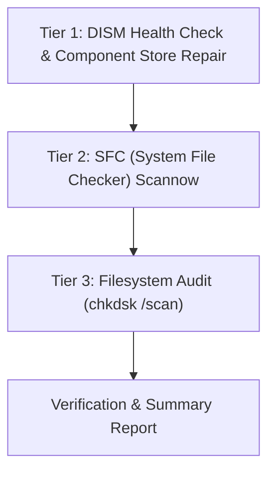

# Windows System Integrity & Repair Hero

This skill equips agents and sub-agents with the ability to diagnose, verify, and repair damaged, corrupted, or missing Windows operating system files and component stores, especially after malware infections or system crashes.

---

## 1. Activation Mandate (ط´ط±ط· ط§ظ„طھظپط¹ظٹظ„ ط§ظ„ط­طµط±ظٹ)

> [!IMPORTANT]
> **Activation Requirement**: This skill MUST be activated **ONLY** when the user's prompt explicitly includes the command `repair-system` or `/repair-system`.
> If the command is absent, do NOT run system repair routines.

---

## 2. The 3-Tier Repair Pipeline

To ensure 100% restoration without corruption, the repair process follows a strict sequential pipeline:



### Tier 1: DISM (Deployment Image Servicing and Management)
Repairs the Windows Component Store (`WinSxS`), which SFC relies on as the clean source:
1. `dism /online /cleanup-image /checkhealth`: Quick check if corruption flag is set.
2. `dism /online /cleanup-image /scanhealth`: In-depth scan for component corruption.
3. `dism /online /cleanup-image /restorehealth`: Downloads/restores clean components from Windows Update.

### Tier 2: SFC (System File Checker)
Scans all protected Windows system files and replaces corrupted versions with cached clean copies:
- `sfc /scannow`
- Exit status interpretation:
  - *No integrity violations*: System files are 100% healthy.
  - *Found and successfully repaired*: Damaged files were fixed.
  - *Found but unable to fix*: Requires offline DISM image or reboot.

### Tier 3: Filesystem & Volume Audit
Non-invasive online check of the file system:
- `chkdsk C: /scan` (scans NTFS metadata online without requiring unmount).

---

## 3. Automated Repair Script

Use `system_integrity_repair.py` to run health checks and parse the diagnostics:

```powershell
python "C:\Users\goldl\.gemini\config\skills\system-repair-hero\scripts\system_integrity_repair.py" --action check
```

Supported actions:
- `check`: Runs non-invasive checkhealth and sfc scan.
- `restore`: Executes full DISM restorehealth followed by SFC scannow.

---

## 4. References

- [DISM & SFC Repair Guide](file:///C:/Users/goldl/.gemini/config/skills/system-repair-hero/references/dism_sfc_repair_guide.md): In-depth command guide, CBS.log analysis, and troubleshooting repair failures.
