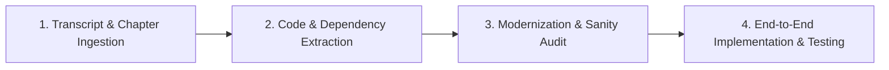

# Tutorial to Code Execution Guide

This document outlines the standard operating procedure for transforming video tutorials and technical walkthroughs into fully implemented, tested, and verified codebases.

---

## 1. The 4-Stage Execution Pipeline

### Stage 1: Ingestion
- Retrieve the complete transcript and chapter markers.
- Identify the core problem the video addresses.

### Stage 2: Code Extraction
- Identify:
  - Required package installations (`npm install`, `pip install`).
  - Configuration files (`.env`, `config.yaml`, `tsconfig.json`).
  - Core logic, algorithms, or API endpoints.

### Stage 3: Modernization & Sanity Audit
- Video tutorials often age quickly:
  - Check if any imported packages are deprecated (e.g., older React class components, outdated Pydantic v1 syntax).
  - Update to current stable standards while preserving the exact functionality demonstrated.

### Stage 4: Execution & Verification
- Write the code directly into the user's workspace using `write_to_file` and `replace_file_content`.
- Run tests or compile the code (`py_compile`, `npm test`, etc.) to prove it works 100%.
- Deliver results concisely to the user.
